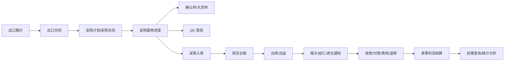

# 需求范围

## 资料来源

本需求范围基于 `docs/reference/远景外贸业务管理系统产品介绍-含仓库管理.pdf` 梳理。

PDF 中包含两类需求：

1. 外贸管理系统通用版功能：基础资料、样品、出口业务、采购业务、单证、财务、仓库、经理查询与统计分析。
2. 定制开发说明：采购合同跟单流程、QC 查验、商品配件明细、由出口合同生成采购合同、利润核算成本归集、日程管理。

## 业务目标

建设一套覆盖外贸业务主流程的信息系统，将销售、采购、仓储、单证、财务和管理分析的数据打通，减少重复录入，强化审批和提醒，帮助企业形成可查询、可追踪、可核算的业务闭环。

## 核心业务主线

## 功能范围

### 通用基础能力

- 用户、组织、角色、权限、数据范围。
- 审批流程配置、审批任务、审批查询。
- 工作桌面、公司公告、待办任务、消息提醒、工作计划。
- 模糊查询、组合过滤、排序、自定义字段、自定义视图。
- 附件、图片、导入导出、打印模板、PDF/Excel 输出。
- 操作日志、数据变更日志、业务单据编号规则。

### 业务资料

- 商品资料：中英文名称、图片、规格、海关编码、税率、包装、历史交易。
- 商品配件明细：主要配件、单位耗料、采购生成规则。
- 客户资料：客户信息、联系人、信用等级、授信额度、交易记录。
- 供应商资料：供应商信息、联系人、信用等级、授信额度、交易记录。
- 合作伙伴：快件公司、货代、保险、运输等。
- 单证资料：收货人、通知人、开证行、提单通知人等。

### 样品管理

- 打样管理：打样要求、内部打样单、外发工厂、打样费用、进度查询。
- 样品登记：来样、确认样、大货样、客户货号、供应商货号、图片、数量。
- 寄样管理：寄样记录、寄样审核、寄样费用、寄样统计。

### 销售业务

- 出口报价：报价明细、运费、报价模板、审批、历史报价查询。
- 出口合同：客户、产品、价格、出运日期、审批、回签、预收款关联。
- 出货明细：从出口合同生成出运计划，支持多个出口订单一次出运。

### 采购业务

- 采购询价：询价模板、供应商报价、与样品记录关联。
- 采购合同：从出口合同生成采购计划和采购合同，支持库存采购、多个出口合同合并采购。
- 采购跟单：按预定义节点计算预计完成日期，并读取实际完成日期。
- 开票通知：基于报关数据生成供应商开票通知，提醒税票催收。

### QC 查验

- 记录采购合同对应的 QC 查验日期、结果、异常、附件。
- QC 完成日期回写采购跟单节点。
- QC 结果参与正式入库判断。

### 单证管理

- 信用证管理：信用证登记、交单提醒、有效期提醒、议付过程。
- 报关单证：从出货明细生成，支持托单商品和报关商品双明细。
- 结汇单证：从出货明细或报关单证生成。
- 进仓通知：按供应商生成进仓地址、时间和商品明细。
- 客户索赔：投诉、索赔、处理跟踪。

### 财务管理

- 收款管理：银行水单、认领、分摊到合同或发票、应收查询。
- 付款管理：供应商发票、付款申请、审批、已付/未付统计。
- 付费管理：合作伙伴费用发票、费用付款申请、应付费用统计。
- 核销退税：核销单、回单、核销、退税状态。
- 杂费管理：办公费用、资金占用利息、退税利息等分摊。
- 财务结算：锁定单票结算日期，结算日之后费用不进入盈亏测算。
- 利润核算：在原有成本关系上增加手工关联其他成本能力，确保单票毛利归集完整。
- 报销管理：员工报销单登记、审批、付款，与协同办公报销入口共用单据。（PDF §1.3 模块表列于财务管理与协同办公栏，当前未实现）
- 口岸数据导入：导入进出口报关数据，供核销退税与报关数据查询匹配使用。（PDF p54 财务管理架构图节点，当前未实现）
- 财务统计报表：应收款汇总/明细、应付款汇总/明细、应付费用汇总/明细、水单使用情况明细表、银行水单汇总表、货款支付情况查询、费用支付情况查询、报关回单催收查询、核销单使用情况查询、进出口报关数据查询、申报退税统计。（PDF p54 财务管理报表清单，当前仅实现应收/应付/应付费用查询和核销单使用情况查询）

### 仓库管理

- 入库计划：基于采购合同交货期生成待入库清单。
- 货物入库：正式入库、待检入库、入库审批、入库记录。
- 出库计划：基于领料、发料、发货计划生成待出库清单。
- 货物出库：正式出库、异常出库、出库记录。
- 库存调拨：仓库/库位之间移动，防止负库存。
- 库存报表：库存查询、库位管理、入库记录、出库记录。

### 经理查询和统计分析

- 待审批业务单据查询。
- 出口合同统计、采购合同统计、报关出运统计。
- 应收款、应付款、核销单使用情况。
- 业务员出货同期对比、业务员月度出货、客户出货同期对比。
- 采购合同进度查询表。

## 定制开发重点

1. 采购合同跟单流程配置：节点包括合同下单确立、确认样提交、大货样提交、QC 查验、入库、出库。
2. 节点预计日期自动计算：根据合同确立日期、节点所需天数、提前提醒天数生成。
3. 节点实际日期自动读取：样品登记、QC 查验、采购入库、采购出库等模块提供实际完成日期。
4. 采购合同进度查询：按采购合同展示每个节点的预计日期、实际日期、状态和逾期情况。
5. QC 查验模块：登记查验日期、查验结果和异常。
6. 商品配件明细：维护商品主要配件及单位耗料。
7. 自动生成采购合同：出口合同确认后，根据商品配件信息生成一份或多份采购合同。
8. 利润核算增强：支持财务手工关联其他成本。
9. 日程管理：用户登录后查看自己的日程计划。

## 暂不纳入首期的内容

- 与海关、银行、邮件系统的真实外部接口直连。
- 移动端 App。
- 多公司集团化复杂合并报表。
- 大规模微服务拆分。

这些能力可以在业务闭环稳定后按实际需求扩展。
