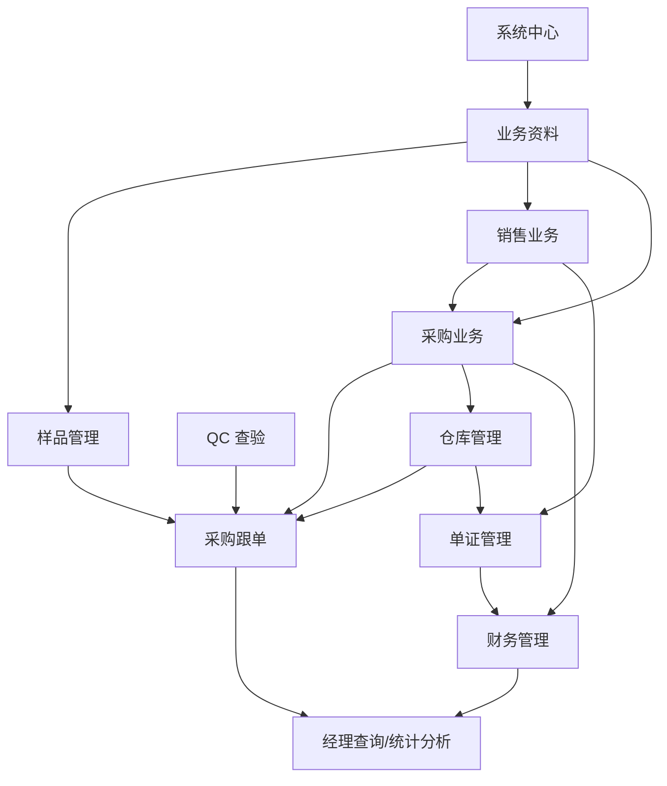

# 模块设计

## 模块总览

## 系统中心

职责：

- 统一管理组织、用户、角色、权限、菜单、数据范围。
- 提供审批流、待办、消息、提醒、公告、日程。
- 提供附件、图片、字典、编号规则、模板、导入导出。
- 提供操作日志、登录日志、数据变更日志。

核心对象：

- User、Department、Role、Permission、Menu。
- WorkflowDefinition、WorkflowInstance、ApprovalTask。
- Notification、TodoTask、ScheduleEvent。
- Attachment、PrintTemplate、ImportJob、AuditLog。

关键规则：

- 所有业务单据接入统一审批状态。
- 权限分为功能权限、数据权限、字段权限和流程权限。
- 提醒统一由业务事件和定时任务触发。

## 业务资料

职责：

- 为销售、采购、单证、仓库和财务提供统一主数据。
- 维护商品、客户、供应商、合作伙伴和单证常用资料。

核心对象：

- Product：商品主档。
- ProductAccessory：商品配件明细，记录单位耗料。
- Customer、CustomerContact。
- Supplier、SupplierContact。
- Partner、PartnerContact。
- DocumentParty：收货人、通知人、开证行、提单通知人等。

关键规则：

- 商品可绑定海关编码、税率、包装信息、图片。
- 客户和供应商支持信用等级、授信额度、交易历史。
- 商品配件明细是自动生成采购合同的重要依据。

## 样品管理

职责：

- 管理打样、来样、确认样、大货样和寄样。
- 为采购跟单提供确认样、大货样实际完成日期。

核心对象：

- SampleRequest：打样要求。
- SampleRecord：样品登记。
- SampleDelivery：寄样记录。
- SampleFee：样品费用。

关键规则：

- 样品分类需要能区分确认样、大货样等节点来源。
- 样品记录可关联客户、供应商、商品、出口合同、采购合同。
- 寄样费用可进入费用统计，必要时参与利润核算。

## 销售业务

职责：

- 管理客户报价、出口合同和出货明细。
- 作为整个业务数据流转的源头。

核心对象：

- ExportQuotation、ExportQuotationLine。
- ExportContract、ExportContractLine。
- ShipmentPlan、ShipmentLine。

关键规则：

- 报价审批通过并被客户确认后，可生成出口合同。
- 出口合同审批通过后，可生成采购计划和出货计划。
- 出货明细可由多个出口合同合并生成。
- 出口合同需要统计总数量、总金额、已出货、未出货、已采购、未采购。

## 采购业务

职责：

- 管理采购询价、采购合同、开票通知。
- 将出口合同需求转成供应商履约任务。

核心对象：

- PurchaseInquiry、PurchaseInquiryLine。
- PurchaseContract、PurchaseContractLine。
- PurchaseInvoiceNotice。
- PurchasePlan。

关键规则：

- 可从出口合同直接生成采购计划。
- 可根据商品配件明细拆分生成一份或多份采购合同。
- 支持无出口订单的库存采购。
- 支持多个出口合同合并到同一采购合同。
- 采购合同审批通过后，生成交货提醒、付款提醒和跟单节点计划。

## 采购跟单

职责：

- 定义采购合同履约流程节点。
- 跟踪每个采购合同的预计完成日期、实际完成日期和逾期情况。

核心对象：

- FollowProcessTemplate：跟单流程模板。
- FollowProcessNode：节点定义。
- PurchaseFollowPlan：采购合同跟单计划。
- PurchaseFollowNode：采购合同节点实例。

默认节点：

1. 合同下单确立。
2. 确认样提交。
3. 大货样提交。
4. QC 查验。
5. 入库。
6. 出库。

关键规则：

- 节点预计日期 = 基准日期 + 节点所需天数。
- 提醒日期 = 预计日期 - 提前提醒天数。
- 实际日期从业务模块读取：样品登记、QC 查验、采购入库、采购出库。
- 节点状态包括未开始、进行中、已完成、已逾期、异常。

## QC 查验

职责：

- 登记采购合同的 QC 查验日期、查验结果和异常处理。
- 为采购跟单和正式入库提供判断依据。

核心对象：

- QualityInspection。
- QualityInspectionLine。
- QualityIssue。

关键规则：

- QC 记录必须关联采购合同，可细化到采购合同明细。
- QC 结果包括通过、不通过、部分通过、待复检。
- QC 通过日期可作为采购跟单中 QC 查验节点的实际完成日期。
- 正式入库需要校验对应货物已通过 QC 或满足豁免条件。

## 仓库管理

职责：

- 管理入库计划、货物入库、出库计划、货物出库、库存调拨和库存查询。
- 为采购跟单提供入库、出库实际完成日期。

核心对象：

- Warehouse、Location。
- InboundPlan、InboundPlanLine。
- InboundOrder、InboundOrderLine。
- OutboundPlan、OutboundPlanLine。
- OutboundOrder、OutboundOrderLine。
- StockTransfer、StockTransferLine。
- InventoryBalance、InventoryLedger。

关键规则：

- 入库计划可由采购合同交货期生成。
- 入库分为待检入库和正式入库。
- 正式入库需校验商品、数量与计划一致，并且 QC 通过。
- 出库分为正式出库和异常出库。
- 调拨过程中动态更新库存，禁止非授权负库存。
- 所有库存变化必须写入库存流水。

## 单证管理

职责：

- 管理信用证、报关单证、结汇单证、进仓通知和客户索赔。
- 复用出口合同和出货明细数据，减少重复录入。

核心对象：

- LetterOfCredit。
- CustomsDeclaration、CustomsDeclarationLine。
- SettlementDocument、SettlementDocumentLine。
- WarehouseEntryNotice。
- CustomerClaim。

关键规则：

- 报关单证从出货明细复制商品数据。
- 报关支持托单商品和报关商品双明细。
- 结汇单证可从出货明细或报关单证生成。
- 进仓通知按供应商和进仓要求生成。

## 财务管理

职责：

- 管理收款、付款、付费、核销退税、杂费、财务结算和利润核算。

核心对象：

- BankReceipt：银行水单。
- ReceiptAllocation：收款分摊。
- SupplierInvoice：供应商发票。
- PaymentRequest：付款申请。
- PartnerFeeInvoice：合作伙伴费用发票。
- FeePaymentRequest：付费申请。
- VerificationTaxRefund：核销退税。
- MiscExpenseAllocation：杂费分摊。
- FinancialSettlement：财务结算。
- ProfitCalculation：利润核算。
- ProfitCostLink：手工关联成本。

关键规则：

- 收款可按收款性质分摊到出口合同或出口发票。
- 付款申请需关联供应商发票，可审批。
- 付费申请需关联合作伙伴费用发票，可审批。
- 财务结算锁定日期之后的费用不进入对应单票盈亏测算。
- 利润核算支持自动成本来源和手工关联其他成本。

## 经理查询和统计分析

职责：

- 汇总审批、销售、采购、单证、仓库和财务数据。
- 提供管理层查询、统计和预警。

核心报表：

- 待审批单据。
- 出口合同统计。
- 采购合同统计。
- 报关出运统计。
- 应收款统计。
- 应付款统计。
- 核销单使用情况。
- 库存查询、入库记录、出库记录。
- 采购合同进度查询。
- 业务员出货同期对比。
- 业务员月度出货情况。
- 客户出货同期对比。

关键规则：

- 报表口径必须可追溯到原始单据。
- 管理层可按客户、供应商、业务员、合同号、时间区间、商品、状态过滤。
- 逾期节点、异常 QC、异常出库、超授信客户应进入风险视图。
