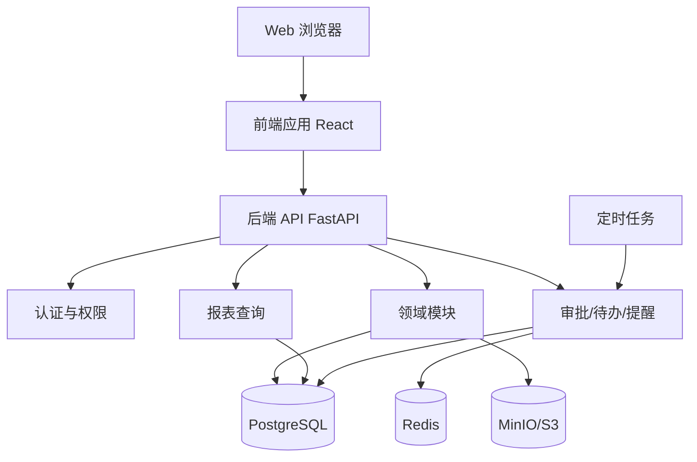
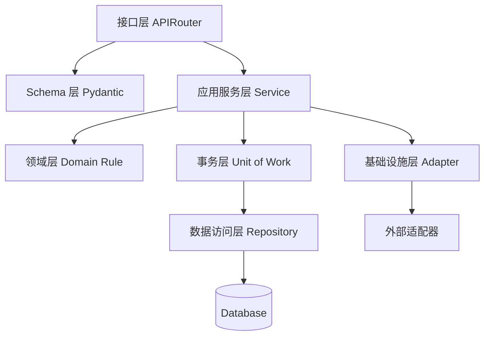
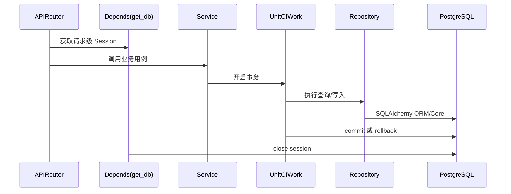
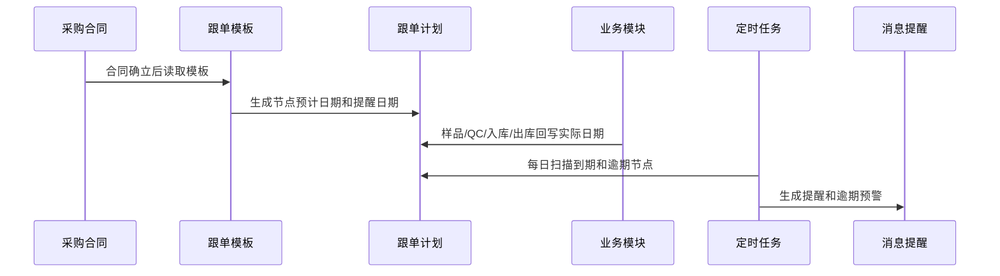
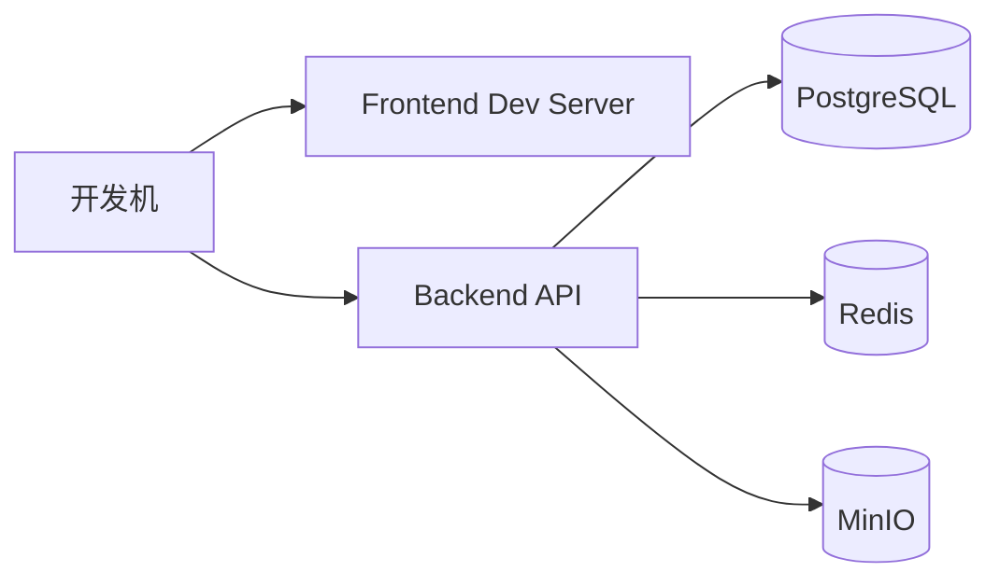

# 架构设计

## 架构原则

- 业务优先：围绕外贸业务主线建模，避免只按页面堆功能。
- 模块化单体优先：首期用一个后端应用承载多个领域模块，降低分布式复杂度。
- 数据一致性优先：合同、库存、财务和利润核算需要强一致的事务边界。
- FastAPI 最佳实践优先：路由薄、Service 承载用例、Repository/DAL 封装查询、依赖注入管理认证和数据库会话。
- Contract-first TDD：新增功能、缺陷修复和重构必须先明确用户/API/架构契约，再写测试和实现。
- 全异步边界：新增或改动的路由、Service、DAL 默认使用 async，避免在事件循环中执行阻塞 I/O。
- 可演进：模块边界清晰，后续可将报表、文件、消息或集成能力拆成独立服务。
- 可审计：关键单据、审批、库存和财务变更必须可追溯。

## 总体架构



## 后端分层



## 分层依赖约束

允许依赖方向：

- `APIRouter -> Service`。
- `APIRouter -> Pydantic Schema`。
- `Service -> Schema / Repository(DAL) / Model 常量 / Core / Infrastructure`。
- `Repository(DAL) -> SQLAlchemy Model / Row Mapper / DB Helper`。
- `Core/Infrastructure` 不依赖业务 Service。

禁止依赖方向：

- APIRouter 不得直接导入 Repository/DAL。
- APIRouter 不得直接导入 SQLAlchemy ORM model。
- APIRouter 不得直接入队后台任务，任务调度由 Service 负责。
- Service 不得导入路由模块里的本地 schema。
- Repository/DAL 不得包含业务决策、权限判断、审批逻辑或通知逻辑。

### 接口层

- 使用 FastAPI `APIRouter` 按业务模块拆分路由。
- 路由只处理 HTTP 语义、请求参数、响应模型和依赖注入。
- 请求和响应使用 Pydantic v2 schema，不直接暴露 ORM model。
- 登录态、权限校验、数据范围通过 `Depends` 注入。
- 新增或修改路由必须显式声明 `response_model=ApiResponse[...]`。
- 统一响应和错误码，禁止临时手写错误字典。
- 路由函数保持轻量：读取参数、获取上下文、调用一个明确的 Service 方法、返回响应。

### 应用层

- 使用 Service 编排用例，例如“出口合同审批通过后生成采购计划”。
- 控制事务边界，复杂写操作通过 Unit of Work 保证一次提交或回滚。
- 权限判断、业务状态流转、后台任务入队、通知发布放在 Service 层。
- 发布业务事件。
- 调用审批、提醒、文件、报表等通用能力。
- 当一个触发动作包含多个业务责任，应拆成有业务名字的能力服务，例如 `purchase_contract_generator.py`、`purchase_follow_plan_service.py`、`inventory_posting_service.py`、`profit_recalculation_service.py`。

### 领域层

- 承载业务规则和状态流转。
- 包括合同、跟单、库存、财务结算、利润核算等领域对象。
- 避免把核心规则散落在 APIRouter 或 SQL 中。

### 数据访问层

- 使用 SQLAlchemy 2.0 ORM。
- Repository/DAL 封装复杂查询和持久化细节。
- 查询对象返回 ORM model 或专用 DTO，由 Service 负责转换输出。
- 报表查询可以使用 SQLAlchemy Core 或数据库视图，但仍通过 Repository 暴露。
- DAL 返回字段必须稳定：优先使用 typed dataclass、`TypedDict`、Pydantic row schema 或明确 row mapper。
- 避免把长期使用的 `dict[str, Any]` 作为 Service 和 DAL 之间的主契约。

### 基础设施层

- 数据库连接、会话工厂和迁移配置。
- 文件存储。
- 模板导出。
- 消息、缓存、定时任务。
- 未来外部系统接口。

## FastAPI 后端目录建议

```text
backend
  app
    main.py
    api
      deps.py
      errors.py
      v1
        router.py
        system.py
        masterdata.py
        sample.py
        sales.py
        purchase.py
        followup.py
        quality.py
        warehouse.py
        documents.py
        finance.py
        reporting.py
    core
      config.py
      security.py
      logging.py
      pagination.py
    db
      session.py
      base.py
      migrations/
    common
      enums.py
      exceptions.py
      responses.py
      audit.py
    modules
      system
        models.py
        schemas.py
        repositories.py
        services.py
        permissions.py
      workflow
        models.py
        schemas.py
        repositories.py
        services.py
      masterdata
      sample
      sales
      purchase
      followup
      quality
      warehouse
      documents
      finance
      reporting
    schemas
      common.py
      pagination.py
      responses.py
      errors.py
    tasks
      scheduler.py
      workers.py
    integrations
      storage.py
      export.py
  tests
    unit
    integration
    e2e
  alembic.ini
  pyproject.toml
```

模块内部约定：

- `models.py`：SQLAlchemy ORM model，只负责数据结构和轻量关系。
- `schemas.py`：Pydantic 输入、输出、查询参数 schema。
- `repositories.py`：数据库查询、锁、分页、聚合。
- `services.py`：业务用例、状态流转、事务编排。
- `permissions.py`：模块级权限、数据范围和字段权限。

共享 schema 约定：

- 跨模块复用的请求、响应、分页、错误结构放在 `app/schemas`。
- 模块内部专用 schema 可以放在 `modules/<module>/schemas.py`。
- 如果历史代码需要旧路径，可保留兼容 re-export，但真实定义只保留一份。

## FastAPI 实践约定

- 新增和改动的 APIRouter、Service、DAL 边界默认使用 `async def`。
- 数据库层优先使用 SQLAlchemy async engine，避免在 async Service 中调用同步 ORM。
- 阻塞文件、网络、对象存储操作不得直接跑在事件循环里；遗留同步代码只能用小范围 `to_thread` 临时桥接，并写明原因。
- 每个请求通过依赖注入创建数据库会话，请求结束自动关闭。
- 写操作默认在 Service 层显式事务中完成，禁止在 Repository 内随意 `commit`。
- 路由函数保持薄逻辑，只调用一个明确的 Service 方法。
- 统一异常映射：领域异常转换为业务错误码，未知异常记录日志后返回通用错误。
- 使用 `response_model` 控制输出字段，敏感字段由 schema 和权限共同控制。
- 列表接口统一支持分页、排序、筛选和数据权限条件。
- OpenAPI 自动文档只暴露稳定接口，内部接口使用独立 tag 或关闭文档暴露。
- 配置通过环境变量和 Pydantic Settings 管理，禁止在代码中写死密钥。

## Schema 和类型约束

API 请求体、查询参数、响应结构和重要错误结构都必须有明确 schema。

- 输入 schema 优先使用 `ConfigDict(extra="forbid")`，除非为了兼容旧接口必须允许额外字段。
- 响应 schema 使用明确字段，避免返回无边界 dict。
- 枚举值、状态值和类型值使用集中定义的常量或 Enum，避免散落硬编码字符串。
- 新增和改动的公开边界不得使用裸 `Any`，包括路由请求/响应、Service 入参/返回、DAL row、任务 payload。
- 外部系统原始 JSON 可以短暂使用 `Mapping[str, Any]`，但进入业务逻辑前必须转换为 typed schema 或 DTO。
- 敏感字段通过 response schema、字段权限和数据权限共同控制。

## 兼容性规则

- 保持既有接口 path、HTTP method、响应字段名和分页字段稳定，除非明确决定做破坏性变更。
- 移动 schema 定义时，如旧代码依赖旧 import 路径，应保留兼容 re-export。
- 改动报表、列表和详情接口时，必须核对前端依赖的字段、空值、权限字段和统计字段。
- 清理数据过滤条件或默认排序前，需要确认这是业务意图，而不只是技术上更干净。

## Contract-first TDD

后端开发采用 Contract-first TDD，尤其适合 AI 辅助编码，避免实现漂移。

每次新增功能、修复缺陷或重构生产代码前，先说明并落测试：

- 用户契约：页面或业务动作的可见结果，例如“采购合同确立后生成 6 个跟单节点”。
- API 契约：路径、方法、请求参数、响应 shape、分页字段、错误码。
- Schema 契约：Pydantic 默认值、枚举、校验规则、禁止额外字段。
- Service 契约：权限、事务、业务状态流转、通知、任务入队。
- DAL 契约：查询条件、返回字段、row mapper 输出类型。
- 架构契约：路由注册、禁止跨层导入、全异步边界。

测试顺序：

1. 先写或确认契约测试。
2. 运行测试，预期红灯应来自缺失行为或边界违规。
3. 实现生产代码。
4. 运行目标测试、架构测试和质量检查，确认绿灯。

推荐测试类型：

- `tests/api`：路由路径、HTTP 方法、`response_model`、错误响应。
- `tests/schemas`：Pydantic 校验、枚举、默认值、响应字段。
- `tests/services`：业务流程、权限、事务、事件、任务。
- `tests/repositories`：查询条件、锁、分页、typed row mapper。
- `tests/architecture`：禁止 APIRouter 直接导入 DAL/ORM、禁止 Service 导入路由 schema、路由注册检查。

手工验证也要在实现前写清楚：

- 前端页面：打开哪个页面、点击哪个控件、发起哪个请求、用户应看到什么结果。
- 后端接口：调用哪个 endpoint、请求 payload 是什么、响应 shape 和数据库状态如何变化。

## 数据库会话和事务



事务原则：

- 一个用户动作对应一个明确事务边界。
- 库存入库、出库、调拨必须锁定库存行或使用数据库约束避免并发超卖。
- 收款分摊、付款审批、利润重算在同一事务中写入业务表和审计日志。
- 审批通过后触发的后续动作优先在同一事务中写入业务事件表，再由后台任务异步投递提醒。

## 前端架构

前端技术栈改为 `React + TypeScript + Vite`。当前功能验证阶段已用 Ant Design 跑通表格、表单、筛选、弹窗、通知、分页和审批类控件；后续 UI 重构阶段统一切换到 Semi Design，并按主数据、单据、流程、仓库、财务、报表拆分不同页面形态。业务 API 契约继续复用 FastAPI 的 `ApiResponse[T]` 返回结构。既有 Vue 原型只作为迁移参考，不再作为后续新增功能的实现目标。

```text
frontend/src
  app
    App.tsx
    routes.ts
  api
    client.ts
    types.ts
  components
    layout
    data
    forms
  layouts
  modules
    system
    masterdata
    sample
    sales
    purchase
    followup
    quality
    warehouse
    documents
    finance
    reporting
```

前端设计重点：

- 企业后台式信息架构，左侧菜单 + 顶部工作区 + 可恢复的模块工作面。
- 列表页统一支持筛选、排序、列配置、导入导出。
- 单据页统一支持明细行、附件、审批记录、操作日志。
- 工作桌面展示待办、提醒、日程、公告和风险预警。
- 报表页支持多条件查询、下钻到原始单据。
- Semi Design 重构详见 `docs/07-SemiDesign前端UI重构设计.md`；禁止所有业务页继续复制同一套“指标条 + 左表格 + 右表单”模板。
- 首屏保持高密度、轻量、可扫描，避免营销式 Hero、装饰性卡片堆叠和单一蓝紫色主题。
- React 迁移按功能检查记录逐步完成：每迁移一个模块，必须更新检查文档并运行对应 E2E。

## 数据库设计策略

- PostgreSQL 作为主库。
- 所有业务表使用统一字段：id、tenant_id、created_at、created_by、updated_at、updated_by、deleted_at、version。
- 数据迁移使用 Alembic，所有表结构变更必须生成迁移脚本。
- SQLAlchemy model 与 Pydantic schema 分离，避免接口字段被数据库结构牵着走。
- Alembic 迁移脚本必须随模型变更一起提交，禁止只改 model 不改迁移。
- 关键唯一性和库存约束应落到数据库层，例如单据编号唯一、库存余额不可低于授权下限。
- 金额使用 decimal，不使用浮点。
- 数量使用 decimal，支持不同计量单位。
- 业务单据使用单头/明细结构。
- 库存使用余额表 + 流水表，余额可重算。
- 审批、提醒、附件、日志使用通用表。
- 报表首期基于业务表和查询视图，数据量增大后再引入汇总表。

## 异步任务和调度

- 轻量定时任务可用 APScheduler，例如每日扫描跟单节点、信用证有效期、核销单到期。
- 耗时任务使用 Celery 或 RQ，例如批量导入、Excel/PDF 导出、大报表生成、文件转换。
- API 接口只提交任务并返回任务 ID，前端轮询或通过消息中心查看任务结果。
- 所有后台任务需要幂等键，避免重复执行导致重复提醒、重复生成单据或重复扣减库存。
- APIRouter 不直接创建后台任务，必须通过 Service 生成业务事件或任务请求。

## 异常和错误响应

- 区分未找到、参数非法、权限不足、业务冲突、系统异常。
- 业务异常使用统一业务异常类和稳定错误码。
- 用户可见错误信息保持简洁，后续支持 i18n。
- 未知异常记录结构化日志，API 返回通用错误，不暴露堆栈。
- API 边界不得返回未约束的错误 dict。

## 业务事件设计

业务事件用于模块解耦和提醒生成。

| 事件 | 触发时机 | 订阅方 |
| --- | --- | --- |
| ExportContractApproved | 出口合同审批通过 | 采购、出货计划、提醒 |
| PurchaseContractConfirmed | 采购合同确立 | 跟单、仓库、财务提醒 |
| SampleRegistered | 样品登记 | 采购跟单 |
| QualityInspectionPassed | QC 通过 | 采购跟单、仓库 |
| InboundCompleted | 正式入库完成 | 采购跟单、库存、报表 |
| OutboundCompleted | 正式出库完成 | 采购跟单、库存、单证 |
| BankReceiptClaimed | 水单认领完成 | 财务、利润核算 |
| PaymentApproved | 付款审批通过 | 财务、利润核算 |
| SettlementLocked | 财务结算锁定 | 利润核算、报表 |

## 采购跟单日期计算



## 权限设计

权限分层：

- 功能权限：菜单、按钮、接口。
- 数据权限：本人、本部门、下级部门、全部、指定客户/供应商范围。
- 字段权限：敏感字段如利润、成本、授信额度、银行信息。
- 流程权限：审批、撤回、驳回、作废、反审。

权限校验位置：

- 前端用于控制可见性。
- 后端通过 `Depends` 注入当前用户和权限上下文，通过 Service 执行业务权限强制拦截。
- 报表查询必须应用数据权限。

## 审批和状态设计

通用审批状态：

- draft：草稿。
- submitted：已提交。
- approving：审批中。
- approved：已审批。
- rejected：已驳回。
- cancelled：已作废。
- closed：已关闭。

典型接入单据：

- 出口报价。
- 出口合同。
- 出货明细。
- 采购合同。
- 入库单。
- 出库单。
- 付款申请。
- 付费申请。
- 寄样申请。

## 文件和模板

- 商品图片、样品图片、QC 附件、单证附件存储到对象存储。
- 数据库存储文件元数据和业务关联。
- 打印模板支持报价单、合同、报关发票、装箱单、付款申请等。
- 导出格式优先支持 Excel 和 PDF。

## 部署架构

首期开发环境：



生产起步：

- Nginx 托管前端静态资源并反向代理 API。
- 后端 FastAPI 使用 Uvicorn/Gunicorn 部署，起步可单实例，生产建议至少双实例。
- PostgreSQL 主库定期备份。
- Redis 用于缓存、轻量锁和提醒队列。
- MinIO 存储附件。
- 日志输出到文件或集中式日志系统。

## 质量门禁

代码变更完成前，优先运行窄范围检查，再按风险扩大：

- 目标 `pytest`：schema、api、service、repository、architecture。
- `ruff check`：检查格式、导入和常见问题。
- `mypy` 或 `pyright`：检查改动代码的类型边界。
- `alembic` 检查：确认迁移脚本存在且可升级。
- `git diff --check`：确认无尾随空格和补丁格式问题。

如果全量测试因为历史问题或环境问题失败，需要单独说明失败命令、失败类别、与本次改动无关的原因，以及本次改动相关检查的通过情况。

## 后续演进方向

- 报表数据量增大后，引入报表汇总表或 ClickHouse。
- 搜索需求增强后，引入 OpenSearch。
- 外部接口明确后，新增 integration 模块对接海关、银行、邮件。
- 多公司、多租户复杂化后，拆分租户和权限服务。
- 移动审批需求明确后，增加移动端或企业微信/钉钉集成。
