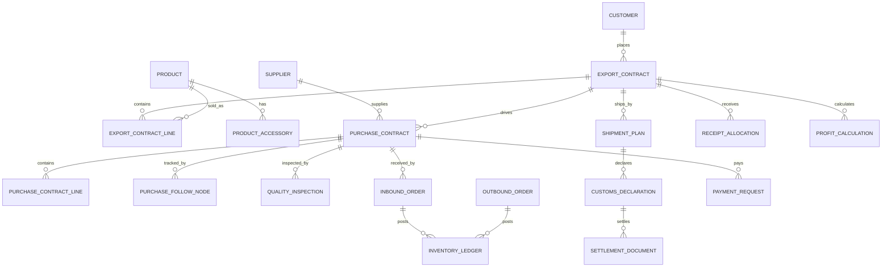

# 数据模型草案

本文件只定义首版核心实体和关系，字段明细需要在 PRD 和页面原型确认后继续细化。

## 核心关系图

## 通用字段

所有核心业务表建议包含：

- id：主键。
- tenant_id：租户或公司 ID，单公司部署也保留。
- code：业务编号。
- status：业务状态。
- approval_status：审批状态。
- created_at、created_by。
- updated_at、updated_by。
- deleted_at：软删除。
- version：乐观锁。

## 主数据

### product

- code、cn_name、en_name、specification、model。
- customs_code、tax_rate、rebate_rate。
- package_info、unit、image_file_id。
- enabled。

### product_accessory

- product_id。
- accessory_product_id 或 accessory_name。
- unit_consumption。
- unit。
- default_supplier_id。
- purchase_split_rule。

### customer / supplier / partner

- code、name_cn、name_en。
- country、address、phone、email。
- credit_level、credit_limit。
- enabled。

### contact

- owner_type：customer、supplier、partner。
- owner_id。
- name、title、phone、email。
- is_primary。

## 销售

### export_quotation

- customer_id、sales_user_id。
- quote_date、currency、trade_term、valid_until。
- total_amount、approval_status。

### export_quotation_line

- quotation_id、product_id。
- specification、quantity、unit、unit_price、amount。
- freight_method、freight_amount。

### export_contract

- customer_id、sales_user_id。
- contract_date、shipment_date。
- currency、trade_term。
- total_quantity、total_amount。
- signed_back_at、prepayment_amount。

### export_contract_line

- contract_id、product_id。
- quantity、unit、unit_price、amount。
- shipped_quantity、purchased_quantity。

### shipment_plan

- export_contract_id。
- planned_ship_date、actual_ship_date。
- status。

## 采购

### purchase_contract

- supplier_id、buyer_user_id。
- source_type：export_contract、stock_purchase、manual。
- source_export_contract_id。
- contract_date、confirmed_at、delivery_date。
- total_quantity、total_amount。
- payment_status。

### purchase_contract_line

- purchase_contract_id。
- product_id 或 accessory_name。
- source_export_contract_line_id。
- quantity、unit、unit_price、amount。
- inbound_quantity、outbound_quantity。

### purchase_invoice_notice

- supplier_id、customs_declaration_id。
- invoice_name、quantity、amount。
- notice_date、status。

## 采购跟单

### follow_process_template

- name、enabled、is_default。

### follow_process_node

- template_id。
- node_code、node_name。
- sequence_no。
- standard_days。
- remind_before_days。
- actual_date_source：sample_confirm、sample_bulk、qc、inbound、outbound、manual。

### purchase_follow_plan

- purchase_contract_id。
- template_id。
- base_date。
- overall_status。

### purchase_follow_node

- follow_plan_id。
- node_code、node_name。
- planned_date、remind_date、actual_date。
- status。
- source_record_type、source_record_id。

## 样品和 QC

### sample_record

- sample_type：incoming、confirm_sample、bulk_sample、retained_sample。
- product_id、customer_id、supplier_id、purchase_contract_id。
- received_at、submitted_at。
- quantity、unit。
- image_file_id。

### quality_inspection

- purchase_contract_id。
- inspected_at。
- result：passed、failed、partial_passed、recheck_required。
- inspector_id。
- issue_summary。
- attachment_group_id。

## 仓库

### warehouse / location

- warehouse：code、name、address、enabled。
- location：warehouse_id、code、name、capacity、enabled。

### inbound_plan / inbound_order

- inbound_plan：purchase_contract_id、planned_date、status。
- inbound_order：warehouse_id、location_id、purchase_contract_id、inbound_type、inbound_at、status。

### outbound_plan / outbound_order

- outbound_plan：source_type、source_id、planned_date、status。
- outbound_order：warehouse_id、location_id、source_type、source_id、outbound_type、outbound_at、status。

### inventory_balance

- warehouse_id、location_id、product_id。
- available_quantity、locked_quantity、pending_inspection_quantity。

### inventory_ledger

- warehouse_id、location_id、product_id。
- direction：in、out、transfer_in、transfer_out、adjust。
- quantity。
- source_type、source_id。
- occurred_at。

## 单证

### letter_of_credit

- customer_id、export_contract_id。
- lc_no、issue_date、expiry_date、presentation_due_date。
- status。

### customs_declaration

- shipment_plan_id。
- declaration_no、declaration_date。
- status。

### settlement_document

- shipment_plan_id、customs_declaration_id。
- document_type。
- issued_at、status。

### warehouse_entry_notice

- supplier_id、shipment_plan_id。
- entry_address、entry_time。
- status。

### customer_claim

- customer_id、export_contract_id、shipment_plan_id。
- claim_date、claim_reason、claim_amount。
- handling_status。

## 财务

### bank_receipt

- customer_id。
- receipt_date、currency、amount。
- bank_reference_no。
- claimed_status。

### receipt_allocation

- bank_receipt_id。
- export_contract_id 或 settlement_document_id。
- allocation_type：prepayment、final_payment、other。
- amount。

### payment_request

- supplier_id、purchase_contract_id。
- invoice_id。
- request_amount、approved_amount、paid_amount。
- payment_type：prepayment、goods_payment、other。
- approval_status。

### fee_payment_request

- partner_id、shipment_plan_id。
- fee_type。
- request_amount、paid_amount。
- approval_status。

### verification_tax_refund

- customs_declaration_id。
- verification_no。
- received_back_at、verified_at、refund_applied_at、refund_received_at。
- status。

### financial_settlement

- export_contract_id 或 shipment_plan_id。
- locked_at。
- locked_by。
- status。

### profit_calculation

- export_contract_id 或 shipment_plan_id。
- sales_amount。
- purchase_cost。
- freight_cost。
- fee_cost。
- tax_refund_amount。
- misc_cost。
- manual_cost。
- gross_profit。

### profit_cost_link

- profit_calculation_id。
- cost_source_type、cost_source_id。
- amount。
- link_reason。
- linked_by、linked_at。

## 报表建议

首期不单独建复杂报表库，优先基于业务表、视图和必要的汇总表实现。

建议预留：

- report_export_contract_summary。
- report_purchase_contract_summary。
- report_shipment_summary。
- report_receivable_summary。
- report_payable_summary。
- report_inventory_snapshot。
- report_purchase_follow_progress。
