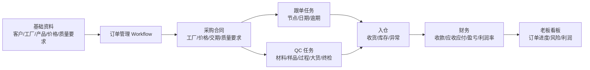
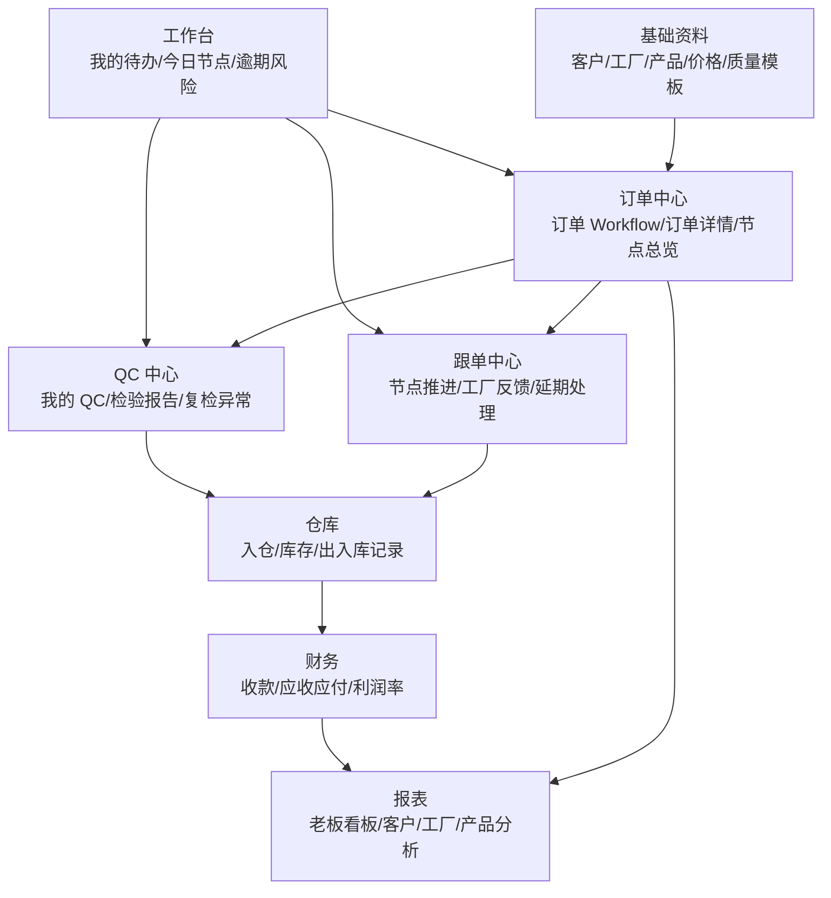

# 传统贸易时尚配饰/服装/香包 ERP 样板

> 目标：把现有“功能很全但散”的外贸系统，收拢成一条以订单为主轴、以 QC 和跟单为执行抓手、以财务盈亏为闭环结果的传统贸易 ERP。

## 参考产品

这些产品不需要照抄界面，主要借鉴它们的模块边界和流程组织方式。

| 产品 | 类型 | 借鉴点 |
| --- | --- | --- |
| [Odoo](https://www.odoo.com/app/sales) | 通用 ERP | 把 CRM、销售、采购、库存、会计做成独立应用，但通过单据自动流转连接起来。适合借鉴“销售订单驱动采购/库存/开票”的模块拼接方式。 |
| [ERPNext](https://docs.frappe.io/erpnext/selling) | 开源 ERP | 模块和数据对象公开清楚，Selling、Buying、Stock、Accounts、Quality Inspection 可作为字段和状态机参考。 |
| [Microsoft Dynamics 365 Business Central](https://learn.microsoft.com/en-us/dynamics365/business-central/across-business-functionality) | 中小企业 ERP | 强调 Role Center、审批 Workflow、销售/采购/库存/财务的标准业务功能。适合借鉴“按角色进入工作台”的信息架构。 |
| [NetSuite ERP](https://www.netsuite.com/portal/products/erp.shtml) | 云 ERP | 订单、库存、采购、仓库、财务在一个统一套件中汇总，适合借鉴“订单到履约再到财务可视化”的管理视角。 |
| [ApparelMagic](https://apparelmagic.com/erp-software/) | 服装/时尚 ERP | 面向款式、SKU、原料、供应商、生产、库存、财务，适合借鉴时尚配饰/服装品类的商品资料和供应链结构。 |
| [WFX](https://www.worldfashionexchange.com/fashion-plm-software/purchase-orders-and-production.html) | 服装 PLM/ERP | 强调采购订单、供应商确认、生产可视化、质量和仓库团队联动，适合借鉴采购合同后的生产跟单流程。 |
| [AIMS360](https://www.aims360.com/features) | Fashion ERP | 覆盖订单、WIP、供应商 PO、多仓、EDI、付款、应收等，适合借鉴“款式/颜色/尺码/渠道/仓库”的服装行业扩展字段。 |
| [BlueCherry](https://bluecherry.com/en) | Fashion supply chain suite | 覆盖设计、采购、生产、质量、库存、物流，适合借鉴“端到端时尚供应链”的模块分层。 |
| [孚盟外贸 ERP](https://www.fumasoft.com/ERP.html) | 外贸 ERP | 采购、单证、财务、库存等外贸流程贴近国内出口企业，适合借鉴外贸业务闭环。 |
| [富通天下](https://sitehd.joinf.com/) | 外贸营销/ERP | 产品、报价、订单、采购、出运、报关、结汇流程完整，适合借鉴外贸单证和报价到订单链路。 |
| [OKKI 小满](https://www.xiaoman.cn/) | 外贸 CRM/订单管理 | 更偏前端获客、客户管理、订单管理，适合借鉴客户跟进和业务员个人工作台，不适合作为后端 ERP 主体。 |

## 产品定位

系统不是“大而全通用 ERP”，而是面向传统贸易公司的一套轻量行业 ERP：

- 行业：时尚配饰、服装、香包、礼品、轻工消费品。
- 公司形态：贸易公司接海外客户订单，外协工厂生产，内部跟单/QC/财务协同。
- 核心诉求：看清每个订单今天在哪个节点、谁负责、是否逾期、货是否能入仓、钱是否收齐、利润是否健康。
- 系统主轴：订单 Workflow。
- 执行抓手：个人待办、QC 任务、跟单任务。
- 结果闭环：入仓、出运、应收应付、盈亏和利润率。

## 总体流程

建议一级导航从“功能模块”改成“业务视角”：

1. 工作台：我的待办、今日节点、逾期、审批、风险。
2. 订单中心：所有订单的 Workflow 总览。
3. QC 中心：所有 QC 检验任务和检验报告。
4. 跟单中心：所有生产/采购节点任务和异常推进。
5. 基础资料：客户、工厂/供应商、产品、价格、质量要求。
6. 仓库：入仓、库存、出入库记录。
7. 财务：收款日期、应收、应付、盈亏、利润率。
8. 报表：老板/经理按订单、客户、工厂、产品、业务员看经营结果。

## 订单 Workflow 样板

每个订单生成一条固定但可配置的 Workflow。用户补充的节点可以作为默认模板：

| 顺序 | 节点 | 示例日期 | 主要责任人 | 系统动作 |
| --- | --- | --- | --- | --- |
| 1 | 下单确认 | 6 月 1 日 | 跟单/采购 | 生成采购合同、工厂任务、QC 计划、跟单节点。 |
| 2 | 材料 QC | 6 月 12 日 | QC | 检查面料、辅料、五金、香包材料等是否符合质量要求。 |
| 3 | 产前样品 | 6 月 13 日 | 跟单/QC | 登记样品、图片、尺寸、工艺、客户确认状态。 |
| 4 | 确认样品 | 6 月 13 日 | 跟单/业务 | 客户确认后锁定关键质量标准，作为后续 QC 依据。 |
| 5 | Online QC | 生产中 | QC | 生产过程检视，记录进度、工艺偏差、返工要求。 |
| 6 | 大货样检验 | 出大货前 | QC/跟单 | 二次确认，检查大货样和确认样是否一致。 |
| 7 | Final QC | 入仓前 | QC | 终期检验，看成品、包装、数量、唛头、箱规。 |
| 8 | 入仓 | Final QC 通过后 | 仓库 | 验收入库，写入库存台账；不通过则进入异常。 |

关键规则：

- 下单时间是所有节点计划日期的基准。
- 每个节点都有计划日期、提醒日期、实际完成日期、责任人、状态、异常原因。
- QC 节点必须有检验地址，工厂地址和验货地址可不同。
- 节点完成不只改状态，还要沉淀证据：图片、附件、检验报告、客户确认记录。
- Final QC 不通过时，入仓默认禁止，除非有经理授权豁免。

## 账号和个人待办

系统首页不应该先展示模块大全，而应该先回答一个问题：我今天要做什么？

### QC 账号

QC 登录后默认看到：

- 今天待检：材料 QC、Online QC、大货样、Final QC。
- 即将到期：未来 3 天需要安排的 QC。
- 逾期未检：超过计划日期仍未完成。
- 异常复检：上次不通过或部分通过，需要复检。
- 验货路线：按验货地址、工厂、日期排序。

QC 任务字段：

- 任务编号、订单号、采购合同号、客户、工厂、产品。
- QC 类型：材料 QC、产前样、确认样、Online QC、大货样、Final QC。
- 计划检验日期、实际检验日期、检验地址、联系人、电话。
- 质量要求、抽检标准、检查清单、结论、问题、图片、附件。
- 结果：通过、不通过、部分通过、待复检、豁免通过。

### 跟单账号

跟单登录后默认看到：

- 我的订单节点：今天应该推进哪些工厂、哪些订单。
- 工厂反馈：待确认交期、待确认样品、待确认返工。
- 逾期节点：材料、样品、生产、QC、入仓任何延期。
- 待协同：需要业务、QC、仓库、财务处理的事项。

跟单任务字段：

- 订单号、客户、工厂、产品、数量、交期。
- 当前节点、下一节点、计划日期、实际日期、责任人。
- 工厂地址、验货地址、联系人。
- 备注、附件、异常、延期原因、处理记录。

## 基础资料

基础资料是 Workflow 自动生成任务和财务核算的来源，不只是“信息录入页”。

### 工厂/供应商

- 工厂编号、名称、简称、国家/地区、地址。
- 默认生产地址、默认验货地址、联系人、电话、微信/邮箱。
- 供货品类、合作状态、信用等级、付款条件。
- 历史订单、历史 QC 通过率、延期次数、异常次数。

### 产品

- 产品编号、中文名称、英文名称、分类。
- 适用品类：配饰、服装、香包、礼品、其他。
- 图片、规格、颜色、尺码/尺寸、材质、包装。
- 商品价格：销售参考价、采购参考价、币种、生效日期、客户/工厂差异价。
- 质量要求：材质标准、尺寸公差、色差标准、工艺要求、包装要求、抽检标准。
- 关联工厂：默认工厂、备选工厂、工厂货号、工厂报价。

### 客户

- 客户编号、名称、国家/地区、地址、联系人。
- 付款条件、币种、信用额度、默认贸易条款。
- 常用质量要求、包装要求、唛头要求、单证要求。
- 历史订单、应收余额、利润贡献。

## 采购合同和质量要求

采购合同不只是采购价格单，应该成为工厂履约和 QC 的依据。

采购合同必须包含：

- 工厂、工厂地址、验货地址、联系人。
- 采购产品、数量、单价、金额、交期。
- 来源订单和客户。
- 质量要求快照：从产品、客户、订单复制而来，允许在合同内微调。
- QC 节点计划：材料 QC、样品、Online QC、大货样、Final QC。
- 付款条件、应付金额、已付金额、未付金额。

质量要求建议做成模板：

- 产品通用质量模板。
- 客户特殊质量模板。
- 工厂特殊工艺模板。
- 采购合同最终质量快照。

这样后续修改产品资料，不会污染已经签出的采购合同。

## MCP 接入建议

这里的 MCP 可以作为 AI/外部工具读取系统数据的统一入口。先不要做复杂集成，建议从只读查询和任务辅助开始。

优先开放的能力：

1. 查询订单 Workflow：按订单号、客户、工厂、责任人、节点状态查询。
2. 查询我的任务：按账号读取今天、逾期、未来 3 天的 QC/跟单任务。
3. 查询采购合同质量要求：给 QC 自动生成检查清单。
4. 查询商品价格：按产品、客户、工厂、币种返回销售参考价和采购参考价。
5. 写入 QC 草稿：允许 AI 根据照片/语音/文字生成 QC 报告草稿，人工确认后提交。

首期不要让 MCP 直接改核心状态，避免绕过审批和责任链。

## 财务管理

首期财务不要先做复杂总账，而要围绕订单利润闭环：

| 财务项 | 用途 | 来源 |
| --- | --- | --- |
| 收款日期 | 判断客户是否回款、是否逾期 | 收款单/银行水单 |
| 应收金额 | 客户应该付多少 | 销售订单/出口合同 |
| 已收金额 | 客户已经付多少 | 收款登记 |
| 应付金额 | 应付工厂和合作伙伴多少 | 采购合同/费用单 |
| 已付金额 | 已经付款多少 | 付款登记 |
| 盈亏 | 收入 - 采购成本 - 费用 | 订单利润核算 |
| 利润率 | 盈亏 / 收入 | 订单利润核算 |

订单详情页必须直接看到：

- 应收、已收、未收。
- 应付、已付、未付。
- 采购成本、杂费、物流费、检测费、其他成本。
- 预计利润、实际利润、利润率。
- 收款日期、付款日期、逾期天数。

## 推荐信息架构

## 首期 MVP

建议首期先做 6 个页面，不要继续横向铺模块：

1. 工作台：按账号展示我的 QC、我的跟单、我的逾期、我的审批。
2. 订单中心：订单列表 + Workflow 时间轴 + 当前节点 + 风险。
3. 订单详情：客户、工厂、产品、价格、质量要求、节点、财务摘要。
4. QC 中心：QC 任务列表 + 检验表单 + 检验报告。
5. 跟单中心：跟单节点看板 + 延期/异常处理。
6. 财务摘要：按订单看收款日期、应收应付、盈亏、利润率。

首期成功标准：

- 录入客户、工厂、产品后，可以创建订单。
- 订单下单后自动生成 QC/跟单节点。
- QC 和跟单账号能看到自己的今日任务。
- QC 完成 Final QC 后，系统允许入仓。
- 订单能看到收款日期、应收应付、盈亏和利润率。

## 和现有文档的关系

现有文档里的基础资料、样品、销售、采购、仓库、单证、财务、报表功能都可以保留，但产品展示和开发优先级应按新主轴重排：

- `docs/00-需求范围.md` 保留完整功能范围。
- `docs/02-模块设计.md` 继续作为领域模块说明。
- 本文作为“行业样板和流程骨架”，后续页面设计、开发排期、演示脚本应优先按本文组织。

